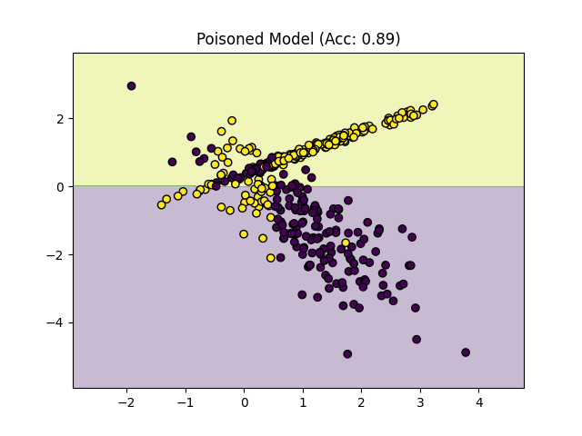

# Data Poisoning Lab (Logistic Regression)

## Objective
Demonstrate how poisoned training data impacts model performance.

## Technique
Label flipping attack ; X% of the training data (35)

## Results

- Baseline Accuracy: X
- Poisoned Accuracy: Y

# Date

4.8.26 -

Console:

```
python3 .\lab.py
[+] Baseline Accuracy: 0.8700
[!] Poisoned Accuracy: 0.8900
```



## Observation

Small changes in training data can greatly impact model behavior.

Initial random data poisoning (15%) resulted in only a minor accuracy drop (~1%), showing that simple random attacks may be ineffective against robust models.

Increasing poisoning strength or targeting critical regions is required to significantly impact model behavior.